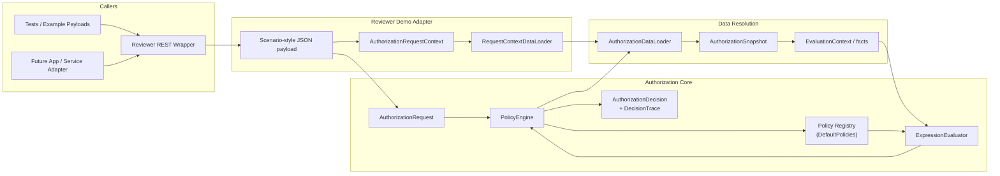
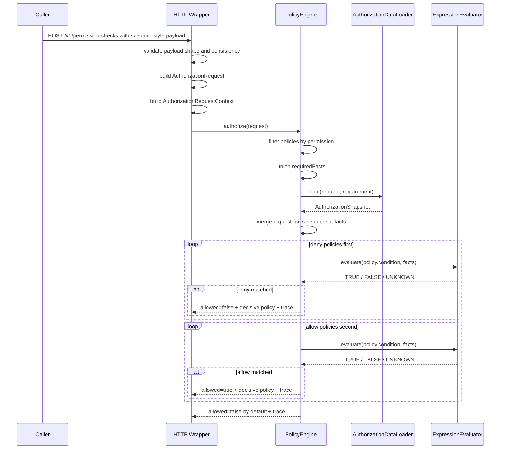

# DESIGN

## 1. Purpose

This repository implements the core of a policy-based authorization system for a collaborative document platform.

The core design goal is to move permission logic out of scattered imperative code and into:

- declarative, serializable policies
- a reusable expression evaluator
- a policy engine with deny-overrides semantics
- a clear separation between data loading and policy evaluation
- reviewer-friendly explanation traces

The core authorization system is a plain Java library.

The repository also includes a thin HTTP wrapper so reviewers can exercise the engine with `curl` and JSON. That wrapper is intentionally a demo boundary, not the preferred production trust model.

## 2. Requirement Mapping

| Assignment requirement | Design element |
| --- | --- |
| Policy-based approach | `PolicyDefinition`, `DefaultPolicies`, `PolicyEngine` |
| Declarative DSL | `dsl` package, JSON-friendly expression model, Jackson mapping |
| Separation of data and logic | `AuthorizationDataLoader` boundary, `AuthorizationSnapshot`, `ExpressionEvaluator` independence |
| Cross-platform structure | path-based DSL, normalized fact map, transport-independent engine |
| Explainability | `AuthorizationDecision`, `DecisionTrace`, `PolicyTrace`, `ExpressionTrace` |
| Deny-overrides and default deny | `PolicyEngine` orchestration |
| Scenario-driven correctness | scenario tests plus REST example payload tests |

## 3. What Is Implemented

The current codebase includes:

- immutable domain types for user, team, project, document, and memberships
- a JSON-friendly expression DSL with field references and logical operators
- a three-valued evaluator using `EvaluationResult.TRUE`, `EvaluationResult.FALSE`, and `EvaluationResult.UNKNOWN`
- a first-class policy model and default policy catalog
- a policy engine with required-data calculation, deny-first evaluation, and default deny
- explanation and trace output for evaluated policies
- unit tests and assignment scenario tests
- a reviewer-facing REST wrapper and Docker run path for manual inspection

## 4. Architecture Overview

### 4.1 Package responsibilities

| Package | Responsibility |
| --- | --- |
| `domain` | Raw domain entities and enums from the assignment |
| `dsl` | JSON-friendly expression model and Jackson support |
| `policy` | permissions, policy metadata, and default policy catalog |
| `engine` | evaluator, request model, and policy orchestration |
| `loader` | data-loading boundary, snapshot, and normalized membership facts |
| `explain` | decision result and trace model |
| `http` | optional reviewer-facing REST adapter over the same engine |

### 4.2 Architecture diagram



### 4.3 Key boundaries

- The evaluator does not know where data came from.
- The policy engine does not know how persistence works.
- Policies remain declarative data.
- The HTTP layer only adapts JSON into the same request + loader contracts used by the core engine.
- Even the reviewer-scoped request loader now respects `DataRequirement` and only materializes the normalized fact paths needed for the requested permission.

## 5. Data Flow



## 6. Domain Model

The raw domain model intentionally matches the assignment.

```java
enum TeamPlan { FREE, PRO, ENTERPRISE }
enum ProjectVisibility { PRIVATE, PUBLIC }
enum MembershipRole { VIEWER, EDITOR, ADMIN }

record User(String id, String email, String name) {}
record Team(String id, String name, TeamPlan plan) {}
record Project(String id, String name, String teamId, ProjectVisibility visibility) {}
record Document(String id, String title, String projectId, String creatorId, Instant deletedAt, boolean publicLinkEnabled) {}
record TeamMembership(String userId, String teamId, MembershipRole role) {}
record ProjectMembership(String userId, String projectId, MembershipRole role) {}
```

## 7. Authorization-Facing Model

The core engine evaluates requests and normalized facts, not repositories or ORM objects.

```java
record AuthorizationRequest(
    String userId,
    String documentId,
    Permission permission,
    Instant requestedAt
) {}

record MembershipFact(
    boolean exists,
    MembershipRole role
) {}

record AuthorizationSnapshot(
    AuthorizationRequest request,
    User user,
    Team team,
    Project project,
    Document document,
    MembershipFact teamMembership,
    MembershipFact projectMembership,
    Map<String, Object> facts
) {}
```

### 7.1 Why normalized facts exist

The evaluator works on a normalized fact map because:

- it keeps the evaluator independent from persistence and transport models
- it makes missing data explicit
- it allows the same DSL to be reused in other runtimes later

Example:

- `projectMembership.exists = false` means the caller is not a project member
- missing `projectMembership.exists` means the loader did not provide enough data

Those two states are intentionally different. The first is ordinary business data. The second becomes `UNKNOWN`.

### 7.2 Fact shape

The normalized fact map uses nested JSON-like structures:

```json
{
  "user": { "id": "u1" },
  "team": { "plan": "pro" },
  "project": { "visibility": "private" },
  "document": {
    "creatorId": "u2",
    "deletedAt": null,
    "publicLinkEnabled": false
  },
  "teamMembership": { "exists": true, "role": "viewer" },
  "projectMembership": { "exists": true, "role": "editor" }
}
```

`EvaluationContext` also accepts dotted-key lookups such as `"user.id"`, but nested maps are the primary shape.

## 8. DSL Syntax

### 8.1 Grammar

```text
Expression
  = Comparison
  | { "and": [Expression, ...] }   // non-empty
  | { "or": [Expression, ...] }    // non-empty
  | { "not": Expression }

Comparison
  = [FieldPath, Operator, LiteralOrRef]

LiteralOrRef
  = string
  | number
  | boolean
  | null
  | ISO-8601 timestamp string
  | { "ref": FieldPath }

Operator
  = "eq" | "ne" | "gt" | "gte" | "lt" | "lte"
```

### 8.2 Canonical JSON shapes

Simple comparison:

```json
["user.id", "eq", "123"]
```

Field reference:

```json
["document.creatorId", "eq", { "ref": "user.id" }]
```

Nested logic:

```json
{
  "and": [
    ["project.visibility", "eq", "private"],
    {
      "or": [
        ["projectMembership.exists", "eq", true],
        ["teamMembership.role", "eq", "admin"]
      ]
    }
  ]
}
```

Null literal:

```json
["document.deletedAt", "eq", null]
```

Date-compatible literal:

```json
["document.deletedAt", "gte", "2026-03-31T00:00:00Z"]
```

### 8.3 Java model

```java
sealed interface Expression
    permits ComparisonExpression, AndExpression, OrExpression, NotExpression {}

record ComparisonExpression(
    String leftField,
    ComparisonOperator operator,
    Operand rightOperand
) implements Expression {}

record AndExpression(List<Expression> expressions) implements Expression {}
record OrExpression(List<Expression> expressions) implements Expression {}
record NotExpression(Expression expression) implements Expression {}

sealed interface Operand permits LiteralOperand, FieldRefOperand {}
record LiteralOperand(Object value) implements Operand {}
record FieldRefOperand(String ref) implements Operand {}
```

Jackson uses canonical operator tokens such as `eq` and `gte`, but the deserializer also accepts symbolic aliases such as `=` and `>=` for prompt-example compatibility.

## 9. Expression Evaluation Semantics

### 9.1 Tri-state result

```java
enum EvaluationResult {
    TRUE,
    FALSE,
    UNKNOWN
}
```

### 9.2 Core rules

- Missing data produces `UNKNOWN`.
- Explicit `null` is a real value and participates in equality checks.
- `UNKNOWN` does not grant permission.
- `UNKNOWN` does not trigger deny precedence by itself.
- Final authorization is still binary. The external response model exposes that as `allowed: true` or `allowed: false`.

### 9.3 Logical truth-table intent

| Operation | Result |
| --- | --- |
| `TRUE and UNKNOWN` | `UNKNOWN` |
| `FALSE and UNKNOWN` | `FALSE` |
| `TRUE or UNKNOWN` | `TRUE` |
| `FALSE or UNKNOWN` | `UNKNOWN` |
| `not UNKNOWN` | `UNKNOWN` |

### 9.4 Comparison rules

- string-to-string: lexical equality or ordering
- number-to-number: numeric comparison via `BigDecimal`
- boolean-to-boolean: equality only
- null equality: `null eq null` is `TRUE`
- unsupported ordered comparisons: `UNKNOWN`
- date/time: if both operands are `Instant` values or ISO-8601 strings parseable by `Instant.parse`, compare as `Instant`

The evaluator is deliberately policy-agnostic. It receives only an expression and facts.

Empty logical arrays are rejected during DSL construction and JSON deserialization. This keeps malformed policies from silently acquiring truth-table semantics such as `and([]) -> TRUE`.

## 10. Policy Model

### 10.1 Policy shape

```java
enum Permission {
    CAN_VIEW("can_view"),
    CAN_EDIT("can_edit"),
    CAN_DELETE("can_delete"),
    CAN_SHARE("can_share")
}

enum PolicyEffect {
    ALLOW,
    DENY
}

record PolicyDefinition(
    String id,
    String description,
    PolicyEffect effect,
    Set<Permission> permissions,
    Expression condition,
    Set<String> requiredFacts
) {}
```

`requiredFacts` is explicit in the current implementation. That keeps loader behavior obvious and deterministic, at the cost of some duplication.

The current implementation also validates policy fact paths eagerly:

- every field path referenced by the condition must belong to the supported normalized fact schema
- every `requiredFacts` entry must belong to that same schema
- `requiredFacts` must cover every fact path referenced by the condition

This avoids a class of hard-to-debug policy authoring errors where a typo in the expression would otherwise degrade into `UNKNOWN`, while a typo in `requiredFacts` would fail later during request handling.

### 10.2 Mandatory assignment policies

The following seven policies are preserved as the mandatory assignment set.

| # | Assignment rule | Implemented policy id |
| --- | --- | --- |
| 1 | Deleted documents cannot be edited, deleted, or shared | `deny_deleted_document_mutations` |
| 2 | Document creators have all permissions | `allow_document_creator_all` |
| 3 | Project editors/admins may edit | `allow_project_editor_or_admin_edit` |
| 4 | Team admins may view/edit/share all team documents | `allow_team_admin_view_edit_share` |
| 5 | Private-project documents are denied to non-members unless the caller is a team admin | `deny_private_project_non_member_access` |
| 6 | Free-plan teams cannot change sharing settings | `deny_free_plan_share` |
| 7 | Public-link-enabled documents may be viewed by anyone | `allow_public_link_view` |

Policies 1, 2, 3, 4, 6, and 7 are implemented exactly as shown below.  
Policy 5 is part of the mandatory set as well, but its final executable form is shown again in section 10.4 because it needs one explicit carve-out to coexist with policy 7.

```json
[
  {
    "id": "deny_deleted_document_mutations",
    "effect": "DENY",
    "permissions": ["can_edit", "can_delete", "can_share"],
    "requiredFacts": ["document.deletedAt"],
    "condition": ["document.deletedAt", "ne", null]
  },
  {
    "id": "allow_document_creator_all",
    "effect": "ALLOW",
    "permissions": ["can_view", "can_edit", "can_delete", "can_share"],
    "requiredFacts": ["document.creatorId", "user.id"],
    "condition": ["document.creatorId", "eq", { "ref": "user.id" }]
  },
  {
    "id": "allow_project_editor_or_admin_edit",
    "effect": "ALLOW",
    "permissions": ["can_edit"],
    "requiredFacts": ["projectMembership.role"],
    "condition": {
      "or": [
        ["projectMembership.role", "eq", "editor"],
        ["projectMembership.role", "eq", "admin"]
      ]
    }
  },
  {
    "id": "allow_team_admin_view_edit_share",
    "effect": "ALLOW",
    "permissions": ["can_view", "can_edit", "can_share"],
    "requiredFacts": ["teamMembership.role"],
    "condition": ["teamMembership.role", "eq", "admin"]
  },
  {
    "id": "deny_private_project_non_member_access",
    "effect": "DENY",
    "permissions": ["can_view", "can_edit", "can_delete", "can_share"],
    "requiredFacts": [
      "project.visibility",
      "projectMembership.exists",
      "teamMembership.exists",
      "teamMembership.role"
    ],
    "condition": {
      "and": [
        ["project.visibility", "eq", "private"],
        ["projectMembership.exists", "eq", false],
        {
          "or": [
            ["teamMembership.exists", "eq", false],
            ["teamMembership.role", "ne", "admin"]
          ]
        }
      ]
    }
  },
  {
    "id": "deny_free_plan_share",
    "effect": "DENY",
    "permissions": ["can_share"],
    "requiredFacts": ["team.plan"],
    "condition": ["team.plan", "eq", "free"]
  },
  {
    "id": "allow_public_link_view",
    "effect": "ALLOW",
    "permissions": ["can_view"],
    "requiredFacts": ["document.publicLinkEnabled"],
    "condition": ["document.publicLinkEnabled", "eq", true]
  }
]
```

### 10.3 Supplemental policies from ambiguity resolution

These are the minimum additions needed to make the six assignment scenarios internally consistent without weakening deny-overrides or default deny.

```json
[
  {
    "id": "allow_project_member_view",
    "effect": "ALLOW",
    "permissions": ["can_view"],
    "requiredFacts": ["projectMembership.exists"],
    "condition": ["projectMembership.exists", "eq", true]
  },
  {
    "id": "allow_project_editor_or_admin_share",
    "effect": "ALLOW",
    "permissions": ["can_share"],
    "requiredFacts": ["projectMembership.role"],
    "condition": {
      "or": [
        ["projectMembership.role", "eq", "editor"],
        ["projectMembership.role", "eq", "admin"]
      ]
    }
  }
]
```

### 10.4 Public-link overlap resolution

Mandatory policy 5 and mandatory policy 7 overlap.

If the private-project deny were applied literally to `can_view`, it would deny guests even when `publicLinkEnabled = true`, which would erase the required public-link allow.

The implemented form is still explicit and policy-driven:

```json
{
  "id": "deny_private_project_non_member_access",
  "effect": "DENY",
  "permissions": ["can_view", "can_edit", "can_delete", "can_share"],
  "requiredFacts": [
    "project.visibility",
    "projectMembership.exists",
    "teamMembership.exists",
    "teamMembership.role",
    "document.publicLinkEnabled",
    "request.permission"
  ],
  "condition": {
    "and": [
      ["project.visibility", "eq", "private"],
      ["projectMembership.exists", "eq", false],
      {
        "or": [
          ["teamMembership.exists", "eq", false],
          ["teamMembership.role", "ne", "admin"]
        ]
      },
      {
        "or": [
          ["request.permission", "ne", "can_view"],
          ["document.publicLinkEnabled", "eq", false]
        ]
      }
    ]
  }
}
```

Interpretation:

- for `can_view`, the deny applies only when the public link is disabled
- for `can_edit`, `can_delete`, and `can_share`, the deny behaves as originally intended

This keeps the public-link carve-out in policy data instead of hiding it in engine code.

## 11. Ambiguity Resolution

The six scenario expectations are part of the source of truth. Re-reading them yields three additional constraints:

- project membership must allow `can_view`, otherwise scenarios 1 and 3 fail
- some project members on paid teams must be able to `can_share`, otherwise scenario 1 fails
- `publicLinkEnabled = true` must allow `can_view` for non-members without granting mutation permissions, otherwise scenario 6 fails

Only two supplemental allow policies were added, and the private-project/public-link overlap was resolved with one narrow executable interpretation. That is the smallest policy change set that satisfies all scenarios while preserving:

- deny-overrides
- default deny
- the original seven mandatory policies as the assignment-required base set

## 12. Policy Engine Behavior

### 12.1 Decision algorithm

For a given `AuthorizationRequest`, the engine:

1. filters policies by requested `Permission`
2. unions `requiredFacts` from those applicable policies
3. removes `request.*` paths because request facts are injected by the engine
4. calls `AuthorizationDataLoader.load(request, dataRequirement)` once
5. builds the evaluation facts from the snapshot plus request facts
6. evaluates deny policies first, in policy order
7. returns `DENY` immediately on the first deny that evaluates to `TRUE`
8. if no deny matched, evaluates allow policies in policy order
9. returns `ALLOW` immediately on the first allow that evaluates to `TRUE`
10. if nothing allowed, returns default `DENY`

### 12.2 Why `requiredFacts` are explicit

The engine uses explicit `requiredFacts` to tell the loader exactly what shape is needed for the current permission check.

Trade-off:

- pro: simple, deterministic, easy to review
- con: duplicated information that could later be inferred from the expression tree

The current reviewer-facing `RequestContextDataLoader` also honors `DataRequirement` when assembling the normalized fact map, so the demo path now demonstrates the same permission-scoped loading contract that the architecture describes.

## 13. Explanation And Trace Design

### 13.1 Output model

```java
record AuthorizationDecision(
    boolean allowed,
    Permission permission,
    String decisivePolicyId,
    String finalReason,
    DecisionTrace trace
) {}

record DecisionTrace(
    AuthorizationRequest request,
    List<PolicyTrace> policyTraces
) {}

record PolicyTrace(
    String policyId,
    PolicyEffect effect,
    EvaluationResult result,
    String summary,
    List<ExpressionTrace> expressionTraces
) {}

record ExpressionTrace(
    Expression expression,
    EvaluationResult result,
    String detail
) {}
```

### 13.2 What the current trace contains

The current implementation returns:

- final `allowed` boolean
- requested permission
- decisive policy id when a policy matched
- final human-readable reason
- ordered traces for each evaluated policy until the decision was finalized
- one top-level expression trace per evaluated policy

Example reasons:

- `Denied by policy deny_deleted_document_mutations: Deleted documents cannot be edited, deleted, or shared.`
- `Allowed by policy allow_document_creator_all: The document creator has all permissions.`
- `Denied by default because no allow policy matched.`

Current limitation:

- traces are per-policy, not full recursive traces for every subexpression node

## 14. REST Wrapper Positioning

The HTTP layer exists because it improves reviewer usability:

- the assignment scenarios can be sent directly as JSON
- the engine can be inspected with `curl` without extra setup
- Docker can expose the same behavior consistently across environments

That convenience comes with an intentional boundary trade-off:

- current `/v1/permission-checks` accepts richer scenario-style context than a production authorization service should normally trust
- the wrapper is therefore a demo contract, not the preferred production contract

The preferred production shape is:

1. client calls app server or API gateway
2. front service authenticates the user
3. front service derives trusted principal and resource identifiers
4. internal authorization layer receives only sanitized identifiers
5. server-side loaders fetch richer facts from trusted sources

In other words, the core engine is production-oriented, while the current HTTP surface is reviewer-oriented.

## 15. Test Coverage

The repository includes four layers of tests:

- [DslJacksonRoundTripTest.java](/Users/moon/Documents/proto/src/test/java/com/example/authz/dsl/DslJacksonRoundTripTest.java): DSL JSON shape and round-trip
- [ExpressionEvaluatorTest.java](/Users/moon/Documents/proto/src/test/java/com/example/authz/engine/ExpressionEvaluatorTest.java): tri-state and comparison semantics
- [PolicyEngineTest.java](/Users/moon/Documents/proto/src/test/java/com/example/authz/engine/PolicyEngineTest.java): deny precedence, required-data handling, creator allow, and default deny
- [AuthorizationScenarioTest.java](/Users/moon/Documents/proto/src/test/java/com/example/authz/scenario/AuthorizationScenarioTest.java): the six assignment scenarios
- [RestExamplePayloadsTest.java](/Users/moon/Documents/proto/src/test/java/com/example/authz/http/RestExamplePayloadsTest.java): reviewer-facing example payloads under `examples/rest`

The scenario coverage explicitly includes:

- general private-project member behavior
- deleted-document deny precedence
- free-plan share denial
- team-admin private-project access
- private-project non-member denial
- public-link view-only behavior

## 16. Trade-Offs

- Path-string field references over generated Java accessors:
  - better portability and cleaner JSON
  - weaker compile-time safety inside Java
- Explicit `requiredFacts` instead of derived requirements:
  - easier to review and reason about
  - duplicates information that could later be inferred
- Normalized string facts such as `free`, `private`, and `admin`:
  - keep the DSL language-independent
  - require a small normalization step in the loader
- A simple in-process `DefaultPolicies` registry:
  - easy to inspect in an interview
  - no dynamic policy management yet
- `EvaluationResult.UNKNOWN` instead of Java `null` inside the evaluator:
  - safer and more explicit internal semantics
  - slightly diverges from the prompt's `boolean | null` example shape
- REST over gRPC for the optional reviewer wrapper:
  - easier to inspect with plain JSON tools in a take-home
  - gRPC would still be a reasonable next step for a centralized internal PDP
- JDK `HttpServer` over a heavier web framework:
  - keeps the wrapper small and the focus on authorization logic
  - avoids obscuring the core design with framework setup
- Boundary validation in the HTTP wrapper instead of the core engine:
  - keeps malformed-request handling close to JSON parsing and HTTP error reporting
  - means non-HTTP callers must construct valid domain requests themselves
- Reviewer-facing full-context REST payload:
  - makes the assignment scenarios directly reproducible
  - is not the preferred production trust boundary

## 17. Current Limitations

- no production persistence adapter; tests use in-memory or request-scoped loaders
- `requiredFacts` are validated eagerly, but they are still maintained manually rather than derived automatically from the expression tree
- no recursive subexpression trace
- no bulk authorization, list filtering, or caching layer
- the current REST layer is a demo boundary, not a production API contract
- the current REST layer accepts richer context than a production authorization service should normally trust
- HTTP validation is intentionally structural, not a full business-validation framework
- no policy editing, hot reload, or external policy store

## 18. Future Improvements

- derive required fact paths automatically from expressions so manual `requiredFacts` duplication can be reduced
- enrich traces with recursive subexpression details
- add SQL, repository-backed, or internal-service-backed loader adapters
- add batch evaluation and caching
- compile simple policy subsets into list-endpoint prefilters
- add a production-oriented internal service contract that accepts only trusted minimal identifiers
